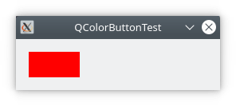
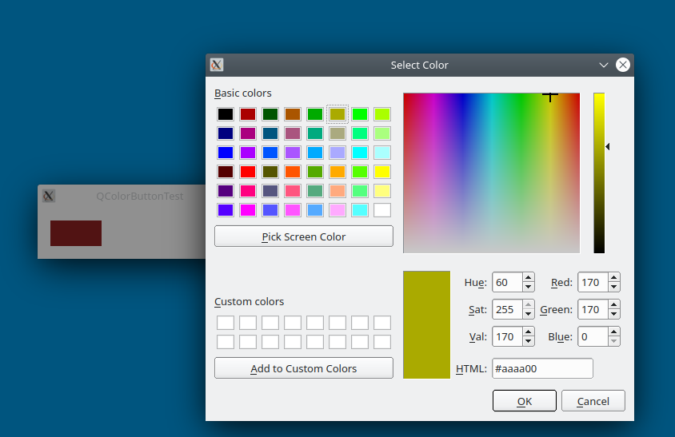
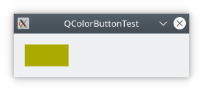

QColorButton
============

QColorButton is a widget to show an initial color and choose a different
color when it's double-clicked.

There's an api to set the initial color for QColorButton and retrieve its
new color.

Copy QColorButton.h and QColorButton.cpp to your project.

ScreenShot
==========

Running the test program will initially show a window with an initial color.
Red in the case of the test program.

Double click the red area to bring up the standard color dialog.

Selecting OK after choosing a different color will result in the red
area changing to the color you chose.

Building QColorButton
=====================

Download the latest code using 'clone'.

    % git clone https://github.com/epasveer/QColorButton

Setup cmake and build

    % cd QColorButton/src
    % cd build
    % cmake ..

    % make

Install it (or not), which will usually copy it to /usr/local/bin.
May need root access.

    % cd QColorButton/src/build
    % sudo make install

LICENSE
=======

QColorButton source code is licensed under the [Apache License](http://www.apache.org/licenses/LICENSE-2.0.html), Version 2.0.

